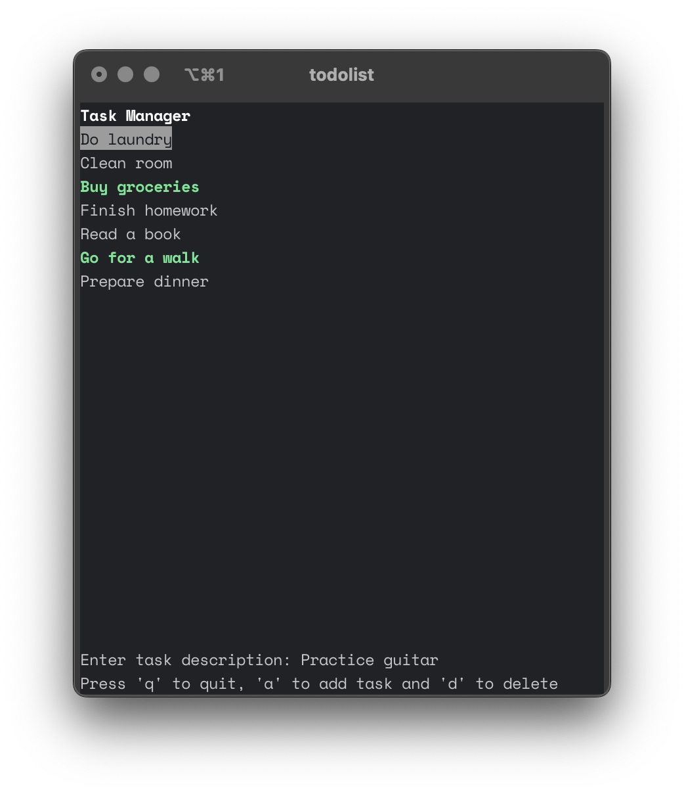

# todolist

A simple command-line task manager built using the `ncurses` library in C.

## Features
- View a list of tasks
- Add new tasks
- Remove existing tasks
- Mark tasks as done/undone
- Navigate through tasks using keyboard arrows
